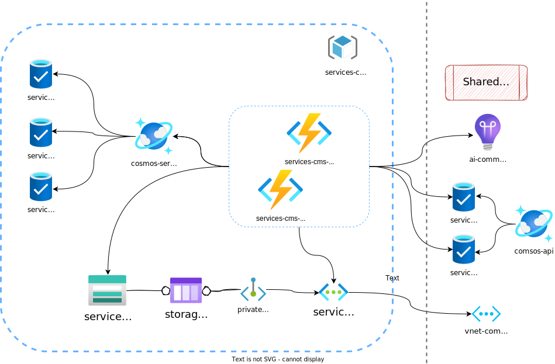

# IO Services CMS
Manages Service lifecycle and publication.

---

## Architecture

## Folder structure
TBD

## Development

### Cloud resources
Cloud resources are defined using terraform for infrastructure-as-code development. There are two terraform projects in this repository:
* `infra` define the resources used by the application
* `.identity` connects GitHub's workflow to be executed by our custom runners (hence inheriting resource access policies). 

Please refer to our [development guide](./docs/terraform-development.md) before contributing.
