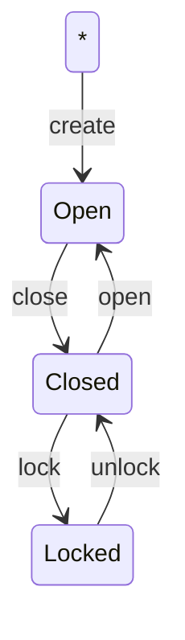

# fp-ts-fms

Finite State Machine (FSM) implementation using [fp-ts](https://github.com/gcanti/fp-ts).

## Example
Given a FSM of a door:



A FMS can be defined as

```ts
import { State, Action, Transition, FSM } from "@pagopa/fp-ts-fsm"

type DoorStates = [
    State<"Open">,
    State<"Closed">,
    State<"Locked">
];
type DoorActions = [
    Action<"create">,
    Action<"close">,
    Action<"open">,
    Action<"lock">,
    Action<"unlock">,
];
type DoorTransitions = [
    Transition<void, "Open", "create", DoorStates, DoorActions>,
    Transition<"Open", "Closed", "close", DoorStates, DoorActions>,
    Transition<"Closed", "Open", "open", DoorStates, DoorActions>,
    Transition<"Closed", "Locked", "lock", DoorStates, DoorActions>,
    Transition<"Locked", "Closed", "unlock", DoorStates, DoorActions>,
];
type DoorFSM = FSM<DoorStates, DoorActions, DoorTransitions>;
```

and implemented as:
```ts
import * as t from "io-ts";

const fsm: DoorFSM = {
  states: {
    Open: t.unknown,
    Closed: t.unknown,
    Locked: t.unknown,
  },
  transitions: [
    {
      id: "apply create on *",
      action: "create",
      from: "*",
      to: "Open",
      exec: () => ({ fsm: { state: "Open" } }),
    },
    {
      id: "apply close on Open",
      action: "close",
      from: "Open",
      to: "Closed",
      exec: (current) => ({ fsm: { state: "Closed" } }),
    },
    {
      id: "apply open on Closed",
      action: "open",
      from: "Closed",
      to: "Open",
      exec: (current) => ({ fsm: { state: "Open" } }),
    },
    {
      id: "apply lock on Closed",
      action: "lock",
      from: "Closed",
      to: "Locked",
      exec: (current) => ({ fsm: { state: "Locked" } }),
    },
    {
      id: "apply unlock on Locked",
      action: "unlock",
      from: "Locked",
      to: "Closed",
      exec: (current) => ({ fsm: { state: "Closed" } }),
    },
  ],
};
```

To apply a transition, we must create an actual implementation of `TransitionApplication`:
```ts
const applyOpen =
  // Any actual implementation of TransitionApplication
  (
    (() => {}) as unknown as TransitionApplication<
      "open",
      DoorStates,
      DoorActions,
      DoorTransitions
    >
  )(fsm, "open");

// Apply Open to an element of id "door-id"
applyOpen("door-id") // TaskEither<Error, {fsm: {state: "Open"}}>;
```

## Known issues
1. Transitions must be implemented in the very same order as they are defined
1. Transitions with the same id MUST NOT be implemented twice (now it's possible)
1. Must use `t.unknown` on states with no data type
