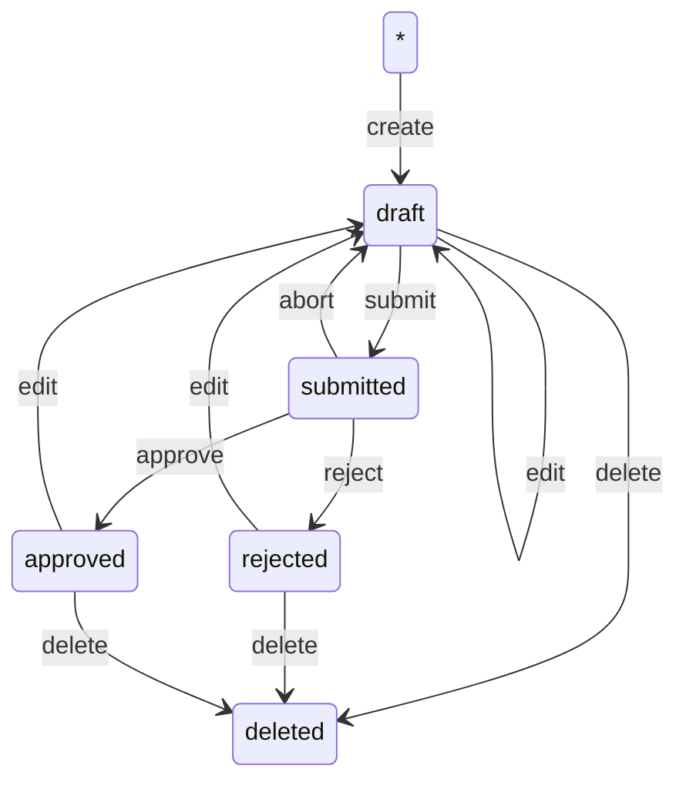
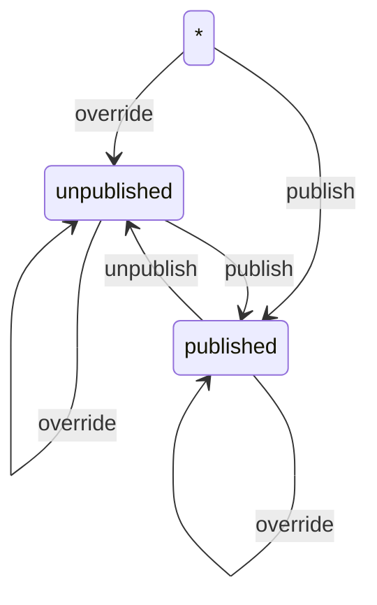

# Models for IO-Services-CMS

Define models for all the applications of the system. This is the module that implements schema, validation, and persistence for data.

## Models

### ServiceLifecycle

A finite state machine (FSM) that defines the lifecycle of a Service



#### Usage

`ServiceLifecycle` can be manipulated via the `apply` function, which applies an action to a service fetched by its `id`. It requires a [`FMSStore`](lib/fsm.ts) implementation to interact with the persistence layer.

The `apply` function accepts three arguments:

| name   | type                      | description                                                  |
| ------ | ------------------------- | ------------------------------------------------------------ |
| action | `string`                  | The name of the action to be applied                         |
| id     | `ServiceId`               | The id of the item subject of the application                |
| args?  | `Record<string, unknown>` | Additional arguments required by the action, see table below |

```ts
import { ServiceLifecycle } from "@io-services-cms/models";

const MyStore; /* define a store to persist data */
const service; /* incoming service data */

const applyTask = ServiceLifecycle.apply("create", "my-id", { data: service });

const result = await applyTask(MyStore)();
```

#### Actions

| action  | arguments                                                                | description                               |
| ------- | ------------------------------------------------------------------------ | ----------------------------------------- | --- |
| create  | \* `data`: the service object to be created, with its `id`               | Create a new service from scratch         | -   |
| edit    | \* `data`: the service object to be created, with its `id`               | Modify an existing service                |
| submit  | \* `autoPublish`: Flag to automatic publish a service on review approval | Submit a service for review               |
| abort   | -                                                                        | Undo a review submission                  |
| reject  | \* `reason`: a message to comment the rejection                          | Reject a service due to validation issues |
| approve | \* `approvalDate`: the timestamp of the approvation                      | Approve a submitted service               |
| delete  | -                                                                        | Delete a service                          |

### ServicePublication

A finite state machine (FSM) that defines the publication of a Service



#### Usage

See the [ServiceLifecycle > Usage](#usage) section above.

#### Actions

| action    | arguments                                                                                        | description                                                            |
| --------- | ------------------------------------------------------------------------------------------------ | ---------------------------------------------------------------------- |
| override  | \* `data`: the service object to be overrided, with its `id`                                     | Override service with a new version                                    |
| publish   | _ `data`: the service object to be published (required only for \___ -> \_published_ transition) | Publish a service                                                      |
| unpublish | -                                                                                                | Undo the last service publication and leave it in an unpublished state |
