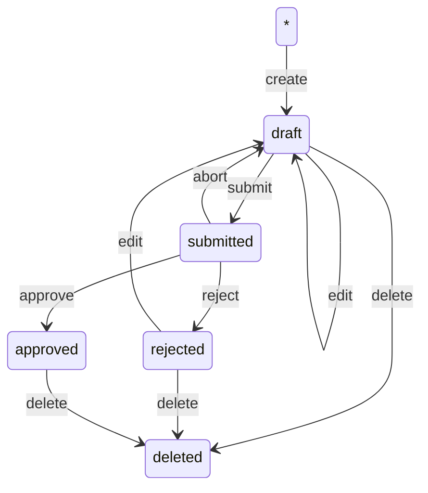

# Models for IO-Services-CMS

Define models for all the applications of the system. This is the module that implements schema, validation, and persistence for data.

## Models

### ServiceLifecycle
A finite state machine (FSM) that defines the lifecycle of a Service



#### Usage
```ts
import { ServiceLifecycle } from "io-services-cms-models";

const MyStore /* define a store to persist data */
const service /* incoming service data */

const applyTask = ServiceLifecycle
    .apply("create", "my-id", { service });

const result = await applyTask(MyStore)();
```
